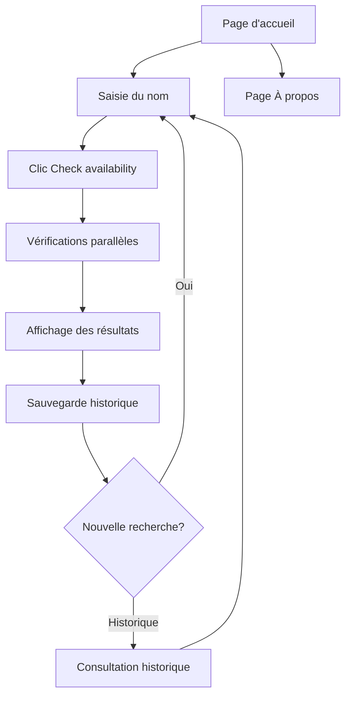

# NameScout - Document de Spécifications Produit

## 1. Vue d'ensemble du produit

NameScout est une application frontend moderne permettant de vérifier rapidement la disponibilité d'un nom sur de multiples plateformes : développement, réseaux sociaux, stores d'applications et domaines web. L'application offre une interface intuitive pour tester simultanément la disponibilité sur GitHub, npm, crates.io, PyPI, les principaux TLD (.com, .io, .fr, .net), les réseaux sociaux (Twitter/X, Instagram, Facebook, LinkedIn, TikTok, YouTube) et autres plateformes pertinentes (Docker Hub, Chrome Web Store, VS Code Extensions, etc.).

L'objectif est de simplifier le processus de recherche de noms pour les développeurs et créateurs de projets en centralisant toutes les vérifications en un seul endroit.

## 2. Fonctionnalités principales

### 2.1 Rôles utilisateur

Pas de distinction de rôles nécessaire - application accessible à tous les utilisateurs sans authentification.

### 2.2 Plateformes de vérification

NameScout vérifie la disponibilité des noms sur les plateformes suivantes, organisées par catégories :

**🔧 Développement & Code**
- GitHub (utilisateurs et organisations)
- npm (packages Node.js)
- PyPI (packages Python)
- crates.io (packages Rust)
- Docker Hub (images Docker)
- Homebrew (formules macOS/Linux)

**🌐 Domaines & Web**
- .com, .net, .org (domaines principaux)
- .io, .dev, .app (domaines tech)
- .fr, .eu (domaines régionaux)

**📱 Réseaux Sociaux**
- Twitter/X (@username)
- Instagram (@username)
- Facebook (pages et utilisateurs)
- LinkedIn (profils et pages)
- TikTok (@username)
- YouTube (chaînes)

**🏪 Stores & Extensions**
- Chrome Web Store (extensions)
- Firefox Add-ons
- VS Code Extensions
- Apple App Store (noms d'apps)
- Google Play Store (noms d'apps)

### 2.3 Module fonctionnel

Notre application NameScout comprend les pages principales suivantes :
1. **Page d'accueil** : champ de saisie, bouton de vérification, affichage des résultats par catégories, filtres, historique des recherches
2. **Page À propos** : informations sur l'application, crédits, liens utiles

### 2.4 Détails des pages

| Nom de la page | Nom du module | Description des fonctionnalités |
|----------------|---------------|----------------------------------|
| Page d'accueil | Formulaire de recherche | Saisir un nom à tester, validation en temps réel, bouton "Check availability" |
| Page d'accueil | Affichage des résultats | Cartes shadcn/ui organisées par catégories (Développement, Réseaux sociaux, Stores, Domaines), icônes de statut (✅/❌/⏳), skeleton loaders pendant le chargement, filtres par catégorie, badges de priorité |
| Page d'accueil | Filtres et tri | Filtrage par catégorie, tri par statut (disponible/pris), recherche dans les résultats, export des résultats |
| Page d'accueil | Historique local | Stockage localStorage des recherches précédentes, affichage chronologique, possibilité de relancer une recherche |
| Page d'accueil | Thème clair/sombre | Basculement entre thèmes avec shadcn/ui, persistance du choix utilisateur |
| Page À propos | Informations | Description de l'application, technologies utilisées, liens vers les APIs utilisées |

## 3. Processus principal

**Flux utilisateur principal :**
1. L'utilisateur arrive sur la page d'accueil
2. Il saisit un nom dans le champ de recherche
3. Il clique sur "Check availability"
4. L'application lance les vérifications en parallèle sur toutes les plateformes (25+ services)
5. Les résultats s'affichent progressivement par catégories avec des icônes de statut et badges de priorité
6. La recherche est automatiquement sauvegardée dans l'historique local
7. L'utilisateur peut consulter l'historique et relancer d'anciennes recherches

## 4. Design de l'interface utilisateur

### 4.1 Style de design

- **Couleurs principales** : Palette moderne avec thème clair/sombre
  - Clair : #ffffff (fond), #000000 (texte), #3b82f6 (accent bleu)
  - Sombre : #0a0a0a (fond), #ffffff (texte), #60a5fa (accent bleu clair)
- **Style des boutons** : Arrondis avec shadcn/ui, effets hover subtils
- **Police** : Inter ou system font, tailles 14px (corps), 16px (boutons), 24px+ (titres)
- **Style de mise en page** : Design centré, cartes avec ombres légères, espacement généreux
- **Icônes** : Lucide React pour cohérence avec shadcn/ui, émojis pour les statuts (✅❌⏳)

### 4.2 Vue d'ensemble du design des pages

| Nom de la page | Nom du module | Éléments UI |
|----------------|---------------|-------------|
| Page d'accueil | Formulaire de recherche | Input shadcn/ui avec placeholder, Button primary avec icône, validation visuelle |
| Page d'accueil | Grille de résultats | Cards shadcn/ui en grid responsive, Badges pour statuts, Skeleton loaders, animations de transition |
| Page d'accueil | Historique | Accordion ou liste déroulante, boutons secondaires pour relancer |
| Page d'accueil | Sélecteur de thème | Toggle button avec icônes soleil/lune, transition fluide |
| Page À propos | Contenu informatif | Typography shadcn/ui, liens avec hover states, layout centré |

### 4.3 Responsivité

Application mobile-first avec adaptation desktop. Optimisation tactile pour mobile avec boutons de taille appropriée (min 44px). Grid responsive qui passe de 1 colonne (mobile) à 2-3 colonnes (tablet/desktop).