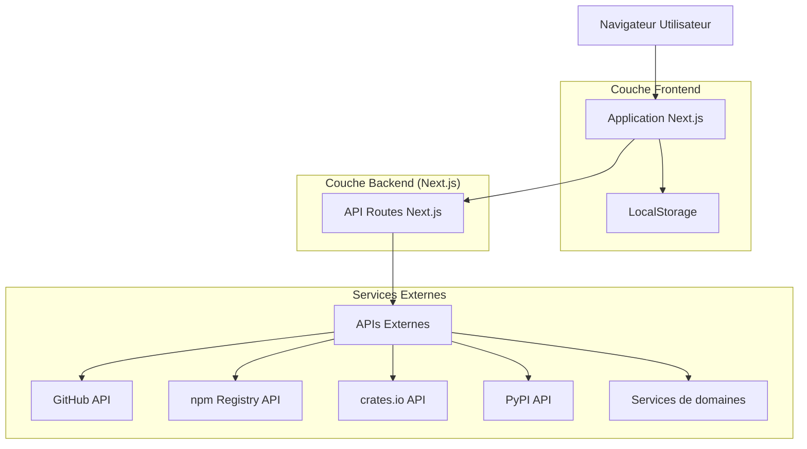
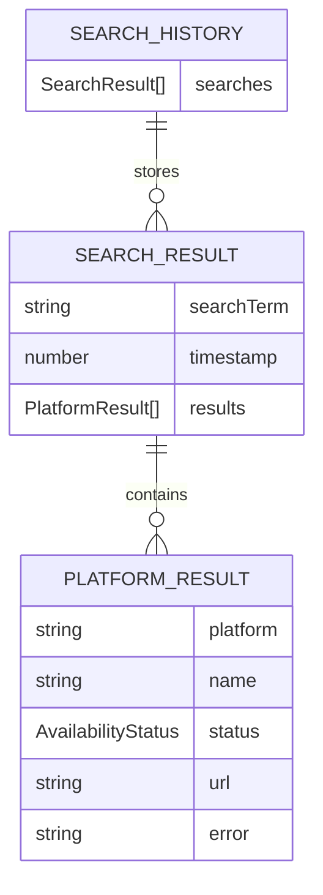

# NameScout - Document d'Architecture Technique

## 1. Conception de l'architecture



## 2. Description des technologies

* **Frontend** : React\@18 + TypeScript\@5 + Next.js\@14 + TailwindCSS\@3 + shadcn/ui

* **Backend** : API Routes Next.js (résout les problèmes CORS)

* **Stockage** : LocalStorage pour l'historique des recherches

* **APIs** : Fetch API native pour les requêtes HTTP

## 3. Définitions des routes

| Route  | Objectif                                                               |
| ------ | ---------------------------------------------------------------------- |
| /      | Page d'accueil avec formulaire de recherche et affichage des résultats |
| /about | Page d'informations sur l'application                                  |

## 3.1 API Routes Next.js

| Route API | Méthode | Objectif |
| --------- | ------- | -------- |
| /api/check/[platform] | GET | Vérifier la disponibilité d'un nom sur une plateforme spécifique |
| /api/check/all | GET | Vérifier la disponibilité d'un nom sur toutes les plateformes |

## 4. Définitions des APIs

### 4.1 Stratégies de détection de disponibilité

Les plateformes utilisent différentes approches pour indiquer qu'un nom d'utilisateur n'existe pas :

| Stratégie | Plateformes | Méthode de détection |
|-----------|-------------|----------------------|
| **Status Code 404** | GitHub, npm, PyPI, crates.io | Vérification directe du status HTTP |
| **Status 200 + Message d'erreur** | Twitter/X, Instagram, LinkedIn, Facebook, TikTok | Parsing du contenu HTML/JSON |
| **API officielle** | YouTube, VS Code Extensions | Requête API avec clé |
| **Test de connectivité** | Domaines web | Timeout ou erreur de connexion |

#### Messages d'erreur textuels par plateforme

| Plateforme | Messages d'indisponibilité (FR) | Messages d'indisponibilité (EN) |
|------------|--------------------------------|--------------------------------|
| **Twitter/X** | "Ce compte n'existe pas", "Compte suspendu" | "This account doesn't exist", "Account suspended" |
| **Instagram** | "Page introuvable", "Utilisateur introuvable" | "Page not found", "User not found" |
| **LinkedIn** | "Profil introuvable", "Membre introuvable" | "Profile not found", "Member not found" |
| **Facebook** | "Page introuvable", "Contenu indisponible" | "Page not found", "Content not available" |
| **TikTok** | "Utilisateur introuvable", "Compte privé" | "User not found", "Private account" |
| **YouTube** | "Chaîne introuvable" | "Channel not found" |

### 4.2 APIs externes utilisées

#### 🔧 Développement & Code

**GitHub**
```
GET https://api.github.com/users/{name}
GET https://api.github.com/orgs/{name}
```

**npm**
```
GET https://registry.npmjs.org/{name}
```

**PyPI**
```
GET https://pypi.org/pypi/{name}/json
```

**crates.io**
```
GET https://crates.io/api/v1/crates/{name}
```

**Docker Hub**
```
GET https://hub.docker.com/v2/repositories/{name}
```

#### 📱 Réseaux Sociaux

**Twitter/X** (via scraping ou API publique)
```
GET https://twitter.com/{name} (vérification existence)
```

**Instagram** (via scraping)
```
GET https://www.instagram.com/{name} (vérification existence)
```

**YouTube**
```
GET https://www.googleapis.com/youtube/v3/channels?forUsername={name}
```

**LinkedIn** (via scraping)
```
GET https://www.linkedin.com/in/{name} (vérification existence)
```

#### 🏪 Stores & Extensions

**Chrome Web Store** (via scraping)
```
Recherche par nom dans le store
```

**VS Code Extensions**
```
GET https://marketplace.visualstudio.com/_apis/public/gallery/extensionquery
```

#### 🌐 Domaines

**Vérification WHOIS** (via service tiers)
```
GET https://api.whoisjson.com/v1/{domain}
```

### 4.3 Types TypeScript

```typescript
type AvailabilityStatus = 'available' | 'taken' | 'checking' | 'error';

type PlatformCategory = 'development' | 'social' | 'stores' | 'domains';

type CheckMethod = 'status-code' | 'content-parsing' | 'api-official' | 'connectivity-test';

type PlatformType = 
  // Développement
  | 'github' | 'npm' | 'pypi' | 'crates' | 'dockerhub' | 'homebrew'
  // Réseaux sociaux
  | 'twitter' | 'instagram' | 'facebook' | 'linkedin' | 'tiktok' | 'youtube'
  // Stores
  | 'chrome-store' | 'firefox-addons' | 'vscode-extensions' | 'app-store' | 'play-store'
  // Domaines
  | 'domain-com' | 'domain-net' | 'domain-org' | 'domain-io' | 'domain-dev' | 'domain-fr';

interface PlatformResult {
  platform: PlatformType;
  category: PlatformCategory;
  name: string;
  status: AvailabilityStatus;
  url?: string;
  error?: string;
  priority?: 'high' | 'medium' | 'low';
  lastChecked?: number;
}

interface SearchResult {
  searchTerm: string;
  timestamp: number;
  results: PlatformResult[];
  totalChecked: number;
  availableCount: number;
  takenCount: number;
}

interface SearchHistory {
  searches: SearchResult[];
}

interface SearchFilters {
  categories: PlatformCategory[];
  status: AvailabilityStatus[];
  priority: ('high' | 'medium' | 'low')[];
}

interface PlatformConfig {
  type: PlatformType;
  category: PlatformCategory;
  name: string;
  icon: string;
  priority: 'high' | 'medium' | 'low';
  apiEndpoint?: string;
  checkMethod: CheckMethod;
  rateLimit?: number;
  errorMessages?: {
    fr: string[];
    en: string[];
  };
  timeout?: number;
}

interface CheckResult {
  status: AvailabilityStatus;
  method: CheckMethod;
  httpStatus?: number;
  responseTime?: number;
  errorMessage?: string;
  detectedLanguage?: 'fr' | 'en';
}

interface AvailabilityChecker {
  checkByStatusCode: (url: string) => Promise<CheckResult>;
  checkByContentParsing: (url: string, errorMessages: string[]) => Promise<CheckResult>;
  checkByApi: (endpoint: string, params: Record<string, any>) => Promise<CheckResult>;
  checkByConnectivity: (domain: string) => Promise<CheckResult>;
}
```

### 4.4 Implémentation de la logique de vérification

#### Exemple d'implémentation hybride

```typescript
// lib/api/availability-checker.ts
const createAvailabilityChecker = (): AvailabilityChecker => {
  const checkByStatusCode = async (url: string): Promise<CheckResult> => {
    const startTime = Date.now();
    try {
      const response = await fetch(url, {
        method: 'HEAD',
        signal: AbortSignal.timeout(5000)
      });
      
      return {
        status: response.status === 404 ? 'available' : 'taken',
        method: 'status-code',
        httpStatus: response.status,
        responseTime: Date.now() - startTime
      };
    } catch (error) {
      return {
        status: 'error',
        method: 'status-code',
        responseTime: Date.now() - startTime,
        errorMessage: error.message
      };
    }
  };

  const checkByContentParsing = async (
    url: string, 
    errorMessages: string[]
  ): Promise<CheckResult> => {
    const startTime = Date.now();
    try {
      const response = await fetch(url, {
        signal: AbortSignal.timeout(10000)
      });
      
      if (response.status === 404) {
        return {
          status: 'available',
          method: 'content-parsing',
          httpStatus: 404,
          responseTime: Date.now() - startTime
        };
      }
      
      const text = await response.text();
      const hasErrorMessage = errorMessages.some(msg => 
        text.toLowerCase().includes(msg.toLowerCase())
      );
      
      return {
        status: hasErrorMessage ? 'available' : 'taken',
        method: 'content-parsing',
        httpStatus: response.status,
        responseTime: Date.now() - startTime,
        detectedLanguage: detectLanguage(text)
      };
    } catch (error) {
      return {
        status: 'error',
        method: 'content-parsing',
        responseTime: Date.now() - startTime,
        errorMessage: error.message
      };
    }
  };

  const checkByApi = async (
    endpoint: string, 
    params: Record<string, any>
  ): Promise<CheckResult> => {
    const startTime = Date.now();
    try {
      const url = new URL(endpoint);
      Object.entries(params).forEach(([key, value]) => {
        url.searchParams.append(key, value);
      });
      
      const response = await fetch(url.toString(), {
        signal: AbortSignal.timeout(8000)
      });
      
      const data = await response.json();
      
      return {
        status: data.error || !data.items?.length ? 'available' : 'taken',
        method: 'api-official',
        httpStatus: response.status,
        responseTime: Date.now() - startTime
      };
    } catch (error) {
      return {
        status: 'error',
        method: 'api-official',
        responseTime: Date.now() - startTime,
        errorMessage: error.message
      };
    }
  };

  const checkByConnectivity = async (domain: string): Promise<CheckResult> => {
    const startTime = Date.now();
    try {
      const response = await fetch(`https://${domain}`, {
        method: 'HEAD',
        signal: AbortSignal.timeout(3000)
      });
      
      return {
        status: 'taken',
        method: 'connectivity-test',
        httpStatus: response.status,
        responseTime: Date.now() - startTime
      };
    } catch (error) {
      // Timeout ou erreur = domaine probablement disponible
      return {
        status: 'available',
        method: 'connectivity-test',
        responseTime: Date.now() - startTime,
        errorMessage: error.message
      };
    }
  };

  return {
    checkByStatusCode,
    checkByContentParsing,
    checkByApi,
    checkByConnectivity
  };
};

// Fonction utilitaire pour détecter la langue
const detectLanguage = (text: string): 'fr' | 'en' => {
  const frWords = ['compte', 'utilisateur', 'page', 'introuvable', 'suspendu'];
  const enWords = ['account', 'user', 'page', 'found', 'suspended'];
  
  const frCount = frWords.filter(word => text.toLowerCase().includes(word)).length;
  const enCount = enWords.filter(word => text.toLowerCase().includes(word)).length;
  
  return frCount > enCount ? 'fr' : 'en';
};
```

#### Configuration des plateformes avec messages d'erreur

```typescript
// lib/platforms.ts
export const PLATFORM_CONFIGS: Record<PlatformType, PlatformConfig> = {
  twitter: {
    type: 'twitter',
    category: 'social',
    name: 'Twitter/X',
    icon: 'twitter',
    priority: 'high',
    checkMethod: 'content-parsing',
    timeout: 10000,
    errorMessages: {
      fr: [
        'Ce compte n\'existe pas',
        'Compte suspendu',
        'Utilisateur introuvable'
      ],
      en: [
        'This account doesn\'t exist',
        'Account suspended',
        'User not found'
      ]
    }
  },
  instagram: {
    type: 'instagram',
    category: 'social',
    name: 'Instagram',
    icon: 'instagram',
    priority: 'high',
    checkMethod: 'content-parsing',
    timeout: 10000,
    errorMessages: {
      fr: [
        'Page introuvable',
        'Utilisateur introuvable',
        'Contenu indisponible'
      ],
      en: [
        'Page not found',
        'User not found',
        'Content not available'
      ]
    }
  },
  github: {
    type: 'github',
    category: 'development',
    name: 'GitHub',
    icon: 'github',
    priority: 'high',
    checkMethod: 'status-code',
    timeout: 5000
  },
  npm: {
    type: 'npm',
    category: 'development',
    name: 'npm',
    icon: 'package',
    priority: 'high',
    checkMethod: 'status-code',
    timeout: 5000
  }
  // ... autres plateformes
};
```

## 5. Structure du projet

```
namescout/
├── public/
│   ├── favicon.ico
│   ├── logo.svg
│   └── platform-icons/   # Icônes des plateformes
├── src/
│   ├── components/
│   │   ├── ui/           # Composants shadcn/ui
│   │   ├── layout/       # Header, Footer, Layout
│   │   ├── search/
│   │   │   ├── SearchForm.tsx
│   │   │   ├── ResultCard.tsx
│   │   │   ├── ResultGrid.tsx
│   │   │   ├── CategoryFilter.tsx
│   │   │   ├── StatusFilter.tsx
│   │   │   └── SearchHistory.tsx
│   │   ├── platform/
│   │   │   ├── PlatformIcon.tsx
│   │   │   ├── PlatformBadge.tsx
│   │   │   └── PlatformCard.tsx
│   │   └── theme/        # ThemeProvider, ThemeToggle
│   ├── pages/
│   │   ├── Home.tsx
│   │   └── About.tsx
│   ├── lib/
│   │   ├── utils.ts      # Utilitaires généraux
│   │   ├── api/
│   │   │   ├── index.ts  # API principale
│   │   │   ├── availability-checker.ts # Logique de vérification hybride
│   │   │   ├── development.ts # APIs dev (GitHub, npm, etc.)
│   │   │   ├── social.ts # APIs réseaux sociaux
│   │   │   ├── stores.ts # APIs stores
│   │   │   └── domains.ts # APIs domaines
│   │   ├── storage.ts    # Gestion localStorage
│   │   ├── platforms.ts  # Configuration des plateformes avec messages d'erreur
│   │   ├── constants.ts  # Constantes de l'app
│   │   └── error-handler.ts # Gestion d'erreurs et fallback
│   ├── hooks/
│   │   ├── useSearch.ts  # Hook de recherche
│   │   ├── useFilters.ts # Hook de filtrage
│   │   ├── useHistory.ts # Hook d'historique
│   │   └── useTheme.ts   # Hook de thème
│   ├── types/
│   │   └── index.ts      # Types TypeScript
│   ├── App.tsx
│   ├── main.tsx
│   └── index.css
├── components.json       # Configuration shadcn/ui
├── tailwind.config.js
├── tsconfig.json
├── vite.config.ts
└── package.json
```

## 6. Modèle de données

### 6.1 Définition du modèle de données



### 6.2 Structure LocalStorage

```typescript
// Clé localStorage : 'namescout-data'
interface StoredData {
  version: string; // Version du schéma pour migrations futures
  history: SearchHistory;
  preferences: {
    theme: 'light' | 'dark' | 'system';
    maxHistoryItems: number;
    defaultFilters: SearchFilters;
    enabledPlatforms: PlatformType[];
    autoSaveResults: boolean;
  };
}

// Exemple de données stockées
const exampleData: StoredData = {
  version: '2.0.0',
  history: {
    searches: [
      {
        searchTerm: 'myproject',
        timestamp: 1703123456789,
        totalChecked: 25,
        availableCount: 12,
        takenCount: 13,
        results: [
          {
            platform: 'github',
            category: 'development',
            name: 'myproject',
            status: 'taken',
            url: 'https://github.com/myproject',
            priority: 'high',
            lastChecked: 1703123456789
          },
          {
            platform: 'npm',
            category: 'development',
            name: 'myproject',
            status: 'available',
            priority: 'high',
            lastChecked: 1703123456790
          },
          {
            platform: 'twitter',
            category: 'social',
            name: 'myproject',
            status: 'taken',
            url: 'https://twitter.com/myproject',
            priority: 'medium',
            lastChecked: 1703123456791
          }
        ]
      }
    ]
  },
  preferences: {
    theme: 'system',
    maxHistoryItems: 100,
    defaultFilters: {
      categories: ['development', 'social', 'stores', 'domains'],
      status: ['available', 'taken'],
      priority: ['high', 'medium', 'low']
    },
    enabledPlatforms: ['github', 'npm', 'twitter', 'domain-com'],
    autoSaveResults: true
  }
};
```

## 6. Gestion d'erreurs et stratégies de fallback

### 6.1 Stratégies de fallback par type d'erreur

| Type d'erreur | Stratégie de fallback | Exemple |
|---------------|----------------------|----------|
| **Timeout** | Marquer comme 'error' et réessayer plus tard | Réseaux sociaux lents |
| **CORS** | Utiliser un proxy ou marquer comme 'unknown' | Certaines APIs bloquent les requêtes cross-origin |
| **Rate Limiting** | Délai progressif et cache des résultats | APIs avec limites strictes |
| **Parsing Error** | Fallback sur détection de mots-clés simples | HTML mal formé |
| **Network Error** | Considérer comme disponible pour les domaines | Domaines inexistants |

### 6.2 Implémentation de la gestion d'erreurs

```typescript
// lib/error-handler.ts
export class AvailabilityError extends Error {
  constructor(
    message: string,
    public platform: PlatformType,
    public errorType: 'timeout' | 'cors' | 'rate-limit' | 'parsing' | 'network',
    public retryable: boolean = false
  ) {
    super(message);
    this.name = 'AvailabilityError';
  }
}

export const handleCheckError = (
  error: unknown,
  platform: PlatformType
): CheckResult => {
  if (error instanceof AvailabilityError) {
    return {
      status: 'error',
      method: PLATFORM_CONFIGS[platform].checkMethod,
      errorMessage: error.message,
      responseTime: 0
    };
  }

  // Gestion des erreurs fetch natives
  if (error instanceof TypeError && error.message.includes('fetch')) {
    // Erreur réseau - pour les domaines, c'est souvent bon signe
    const isdomainCheck = platform.startsWith('domain-');
    return {
      status: isdomainCheck ? 'available' : 'error',
      method: PLATFORM_CONFIGS[platform].checkMethod,
      errorMessage: 'Network error',
      responseTime: 0
    };
  }

  // Timeout
  if (error instanceof DOMException && error.name === 'AbortError') {
    return {
      status: 'error',
      method: PLATFORM_CONFIGS[platform].checkMethod,
      errorMessage: 'Request timeout',
      responseTime: 0
    };
  }

  // Erreur inconnue
  return {
    status: 'error',
    method: PLATFORM_CONFIGS[platform].checkMethod,
    errorMessage: 'Unknown error',
    responseTime: 0
  };
};

// Retry logic avec backoff exponentiel
export const retryWithBackoff = async <T>(
  fn: () => Promise<T>,
  maxRetries: number = 3,
  baseDelay: number = 1000
): Promise<T> => {
  let lastError: unknown;
  
  for (let attempt = 0; attempt <= maxRetries; attempt++) {
    try {
      return await fn();
    } catch (error) {
      lastError = error;
      
      if (attempt === maxRetries) break;
      
      // Backoff exponentiel avec jitter
      const delay = baseDelay * Math.pow(2, attempt) + Math.random() * 1000;
      await new Promise(resolve => setTimeout(resolve, delay));
    }
  }
  
  throw lastError;
};
```

### 6.3 Cache et optimisations

```typescript
// lib/cache.ts
interface CacheEntry {
  result: CheckResult;
  timestamp: number;
  ttl: number;
}

class AvailabilityCache {
  private cache = new Map<string, CacheEntry>();
  
  set(key: string, result: CheckResult, ttlMinutes: number = 30): void {
    this.cache.set(key, {
      result,
      timestamp: Date.now(),
      ttl: ttlMinutes * 60 * 1000
    });
  }
  
  get(key: string): CheckResult | null {
    const entry = this.cache.get(key);
    if (!entry) return null;
    
    if (Date.now() - entry.timestamp > entry.ttl) {
      this.cache.delete(key);
      return null;
    }
    
    return entry.result;
  }
  
  clear(): void {
    this.cache.clear();
  }
}

export const availabilityCache = new AvailabilityCache();
```

## 7. Configuration des outils

### 7.1 Configuration Vite

* Alias `@/` pointant vers `src/`

* Support TypeScript strict

* Optimisation des builds

* Hot reload pour développement

### 7.2 Configuration TailwindCSS

* Intégration avec shadcn/ui

* Support des thèmes clair/sombre

* Classes utilitaires personnalisées

* Purge CSS pour optimisation

### 7.3 Configuration TypeScript

* Mode strict activé

* Résolution des modules avec baseUrl et paths

* Types stricts pour les APIs externes

* <br />

